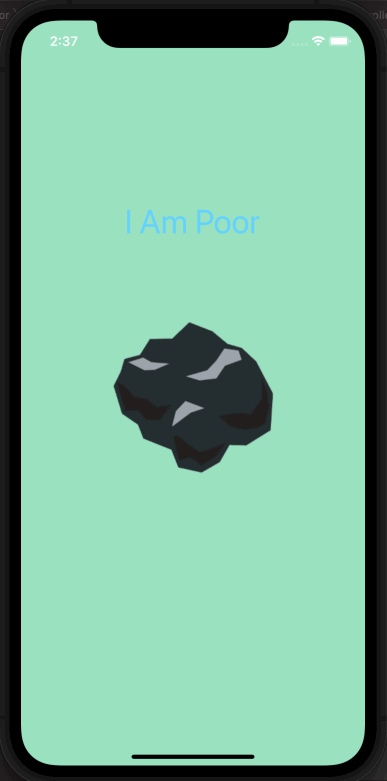

# I Am Poor

## Table of Contents
1. [Description](#Description)
2. [Topic Learned](#Topics-Learned)
3. [Walkthrough](#Walkthrough)

## Description
I Am Poor is an challenge project to implement what we learned from the I Am Rich project.

## Topics Learned
1. Storyboard
2. Designing user interface

## Walkthrough

 

GIF created with [LiceCap](http://www.cockos.com/licecap/).

>This is a companion project to The App Brewery's Complete App Development Bootcamp, check out the full course at [www.appbrewery.co](https://www.appbrewery.co/)
