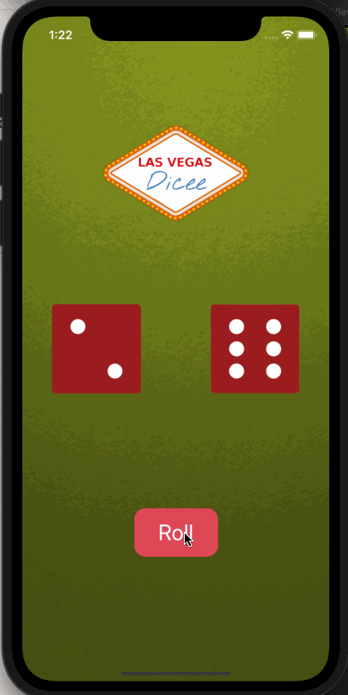

# RandomDice

## Table of Contents
1. [Description](#Description)
2. [Topic Learned](#Topics-Learned)
3. [Walkthrough](#Walkthrough)

## Description
RandomDice is a dice rolling app. You can make the die randomly roll at a press of a button.

## Topics Learned
1. Variables & data structures (Arrays)
2. Randomization (Arrays & random method)
3. Programmically changing UI elements
4. Detecting user interactions

## Walkthrough

 

GIF created with [LiceCap](http://www.cockos.com/licecap/).

>This is a companion project to The App Brewery's Complete App Development Bootcamp, check out the full course at [www.appbrewery.co](https://www.appbrewery.co/)
