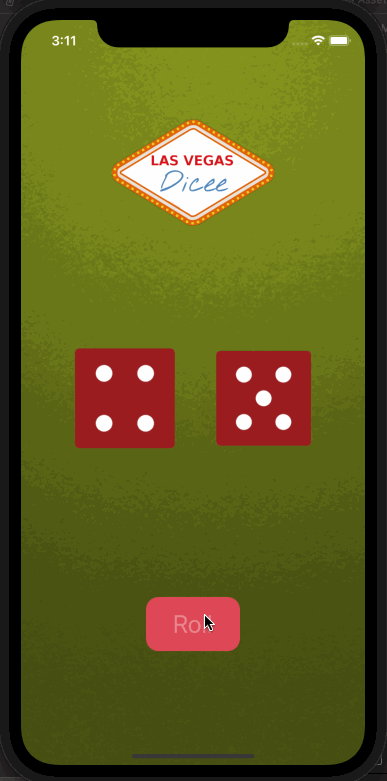

# AutoLayoutUsingDice

## Table of Contents
1. [Description](#Description)
2. [Topic Learned](#Topics-Learned)
3. [Walkthrough](#Walkthrough)

## Description
AutoLayoutUsingDice is a project focusing on using Xcode storyboard's auto layout using the RandomDice project

## Topics Learned
1. Contraints
2. Alignment
3. Containers
4. Stack Views

## Walkthrough

Portrait
 

Landscape
 

GIFs created with [LiceCap](http://www.cockos.com/licecap/).

>This is a companion project to The App Brewery's Complete App Development Bootcamp, check out the full course at [www.appbrewery.co](https://www.appbrewery.co/)
