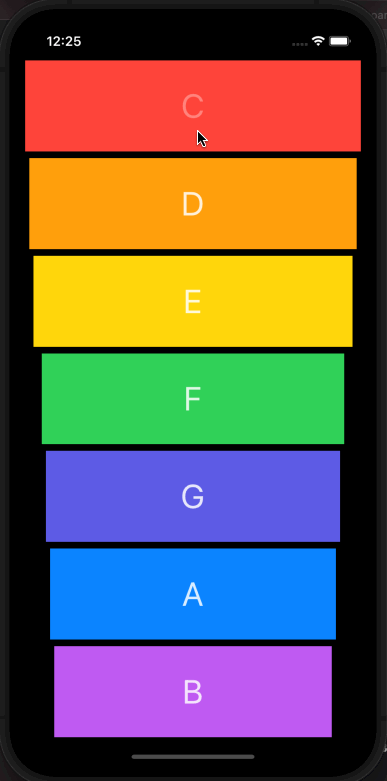

# Xylophone

## Table of Contents
1. [Description](#Description)
2. [Topic Learned](#Topics-Learned)
3. [Walkthrough](#Walkthrough)

## Description
Xylophone is a project that utilize AVAudioPlayer to play different sound for when each xylophone button is pressed.

## Topics Learned
1. AVFoundation (AVAudioPlayer)
2. Linking Multiple elements to one IBAction
3. Creating Methods

## Walkthrough

Portrait
 

GIFs created with [LiceCap](http://www.cockos.com/licecap/).

>This is a companion project to The App Brewery's Complete App Development Bootcamp, check out the full course at [www.appbrewery.co](https://www.appbrewery.co/)
