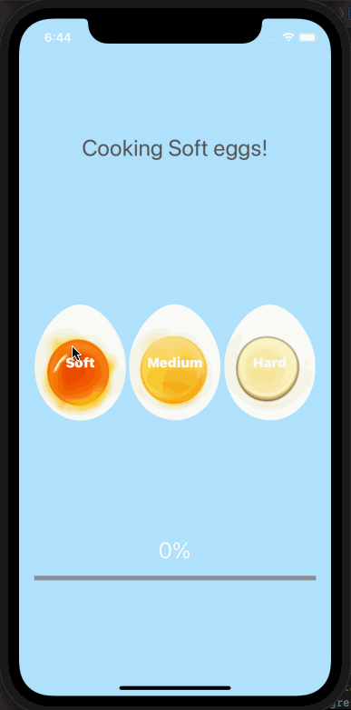

# Egg Timer

## Table of Contents
1. [Description](#Description)
2. [Topic Learned](#Topics-Learned)
3. [Walkthrough](#Walkthrough)

## Description
Egg Timer is a project that boil your eggs to the type of eggs you prefer.

## Topics Learned
1. If/Else & Switch Statements
2. Data structure (Dictionary)
3. Optionals
4. UIProgressView

## Walkthrough

Portrait
 

GIFs created with [LiceCap](http://www.cockos.com/licecap/).

>This is a companion project to The App Brewery's Complete App Development Bootcamp, check out the full course at [www.appbrewery.co](https://www.appbrewery.co/)
