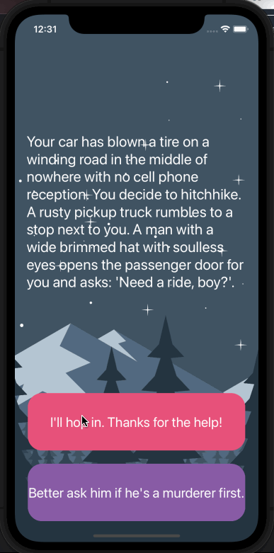

# StoryAdventure

## Table of Contents
1. [Description](#Description)
2. [Topic Learned](#Topics-Learned)
3. [Walkthrough](#Walkthrough)

## Description
StoryAdventure is a challenge project, that is a choose your own text adventure, using what we learn from the previous project. 

## Topics Learned
1. Model-View-Controller (MVC)
2. programmically change UI elements
3. Structs & Classes
4. Object Oriented Programming

## Walkthrough

Portrait
 

GIFs created with [LiceCap](http://www.cockos.com/licecap/).

>This is a companion project to The App Brewery's Complete App Development Bootcamp, check out the full course at [www.appbrewery.co](https://www.appbrewery.co/)
