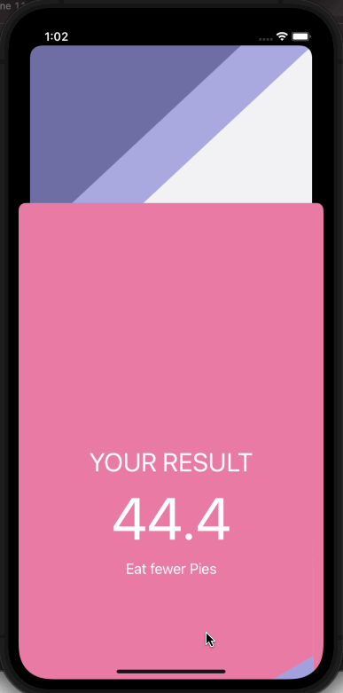

# BMI Calculator

## Table of Contents
1. [Description](#Description)
2. [Topic Learned](#Topics-Learned)
3. [Walkthrough](#Walkthrough)

## Description
BMI Calculator is a project that calculates your BMI. Based on the user's weight and height, the app can determine their body mass and give health advice on whether to eat more pies or eat less pies. 

## Topics Learned
1. Model-View-Controller (MVC)
2. programmically change UI elements
3. Structs & Classes
4. Object Oriented Programming
5. Create multi-screen apps with animated navigation
6. Optional binding, optional chaining, and nil coalescing operator

## Walkthrough

Portrait
 

GIFs created with [LiceCap](http://www.cockos.com/licecap/).

>This is a companion project to The App Brewery's Complete App Development Bootcamp, check out the full course at [www.appbrewery.co](https://www.appbrewery.co/)
