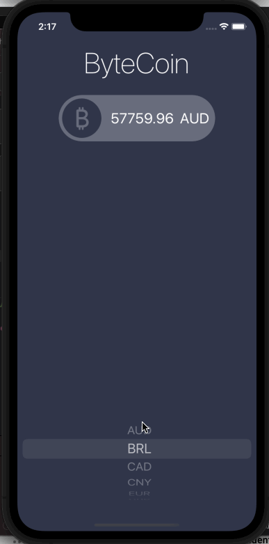

# ByteCoinTicker

## Table of Contents
1. [Description](#Description)
2. [How to Run](#How-to-Run)
3. [Topic Learned](#Topics-Learned)
3. [Walkthrough](#Walkthrough)

## Description
ByteCoinTicker is a challenge project that get the latest bitcoin prices in all popular, traded currency.

## How to Run
1. Register & sign in to https://www.coinapi.io/Account/GetCode for free
2. Copy API key
3. in Xcode, go to CoinManager and paste API key where YOUR_API_KEY
4. Run the app

## Topics Learned
1. Model-View-Controller (MVC)
2. programmically change UI elements
3. Structs & Classes
4. Object Oriented Programming
5. Dark mode enable app
6. Protocols & Delegate design patterns
7. Work with APIs by making HTTP request (URLSession)
8. JSON parsing (JSONDecoder)
9. computed properties, closures, and extensions

## Walkthrough

Portrait
 

GIFs created with [LiceCap](http://www.cockos.com/licecap/).

>This is a companion project to The App Brewery's Complete App Development Bootcamp, check out the full course at [www.appbrewery.co](https://www.appbrewery.co/)
