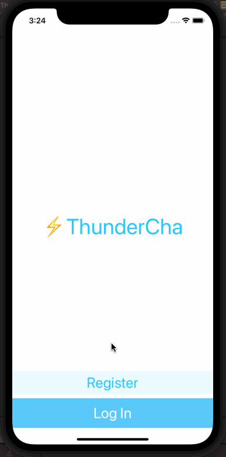

# ThunderChat

## Table of Contents
1. [Description](#Description)
2. [How to Run](#How-to-Run)
3. [Topic Learned](#Topics-Learned)
3. [Walkthrough](#Walkthrough)

## Description
ThunderChat is a project.

## How to Run
1. Register & Sign in to Firebase
2. Download GoogleService-Info.plist
3. Add GoogleService-Info.plist to project
4. Run the app

## Topics Learned
1. Model-View-Controller (MVC)
2. programmically change UI elements
3. Structs & Classes
4. Object Oriented Programming
5. Firebase as a cloud database, user authentication
6. Cocoapods
7. Navigation Controller
8. Custom UI with .xib files

## Walkthrough

Portrait
 

GIFs created with [LiceCap](http://www.cockos.com/licecap/).

>This is a companion project to The App Brewery's Complete App Development Bootcamp, check out the full course at [www.appbrewery.co](https://www.appbrewery.co/)
