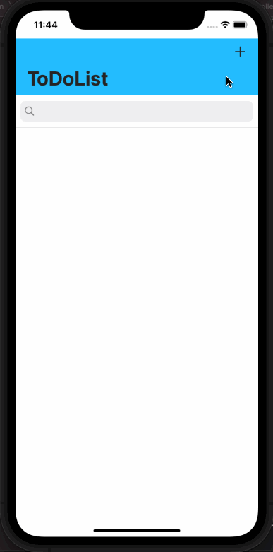

# ToDoList-Realm

## Table of Contents
1. [Description](#Description)
2. [How to Run](#How-to-Run)
3. [Topic Learned](#Topics-Learned)
4. [Walkthrough](#Walkthrough)

## Description
ToDoList-Realm is a project that reworks ToDoList-PersistingData with Realm instead of using Core Data to create the to do list.

## How to Run
1. Go to directory in terminal, type pod install

## Topics Learned
1. Model-View-Controller (MVC)
2. Realm
4. SearchBar
5. NSPredicate
6. TableView SwipeAction

## Walkthrough

Portrait
 

GIFs created with [LiceCap](http://www.cockos.com/licecap/).

>This is a companion project to The App Brewery's Complete App Development Bootcamp, check out the full course at [www.appbrewery.co](https://www.appbrewery.co/)
