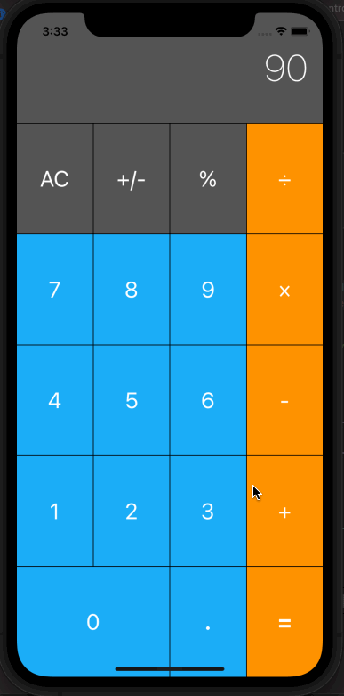

# Calculator

## Table of Contents
1. [Description](#Description)
2. [Topic Learned](#Topics-Learned)
3. [Walkthrough](#Walkthrough)

## Description
Calculator is a project that simulates the basic functions of a calculator.

## Topics Learned
1. Model-View-Controller
2. Struct vs Classes
3. Internal/External Parameter
4. Tuples
5. Access Level

## Walkthrough

Portrait
 

GIFs created with [LiceCap](http://www.cockos.com/licecap/).

>This is a companion project to The App Brewery's Complete App Development Bootcamp, check out the full course at [www.appbrewery.co](https://www.appbrewery.co/)
